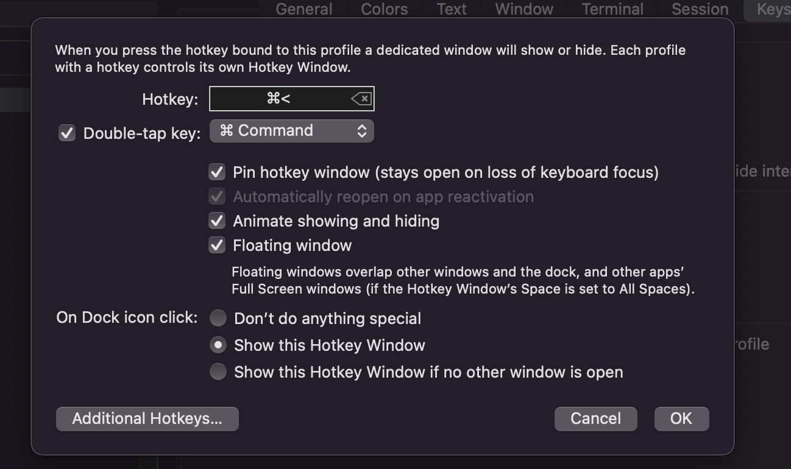

# Overview
This repository contains my MacOS basic configuration, including:
- terminal configuration
- development setup
- authentication software


## Last working OS version
Monterey 12.1

# Steps

## Preliminary setup

### Brew
https://brew.sh/

```
/usr/bin/ruby -e "$(curl -fsSL https://raw.githubusercontent.com/Homebrew/install/master/install)"
```

### Show hidden files

```
defaults write com.apple.finder AppleShowAllFiles -bool true; killall Finder

```

### Xcode
```
xcode-select --install
```

## Keyboard

Import nocfree keybinding (`./nocfree-keybinding`) via vial:

https://get.vial.today/download/


## Terminal setup

### Iterm2
https://iterm2.com/
```
brew cask install iterm2
```

### Iterm2 Key mapping

https://medium.com/macoclock/5-must-have-key-mappings-on-iterm2-to-be-more-productive-21c4daf56348


Hotkey: in



### ZSH

Note: this might not be needed anymore since it's the default in Macos.


### OhMyZsh
https://github.com/ohmyzsh/ohmyzsh
```
sh -c "$(curl -fsSL https://raw.github.com/robbyrussell/oh-my-zsh/master/tools/install.sh)"
```

### Theme
powerlevel10k
`brew install romkatv/powerlevel10k/powerlevel10k`
and follow instructions on iterm2 restart


### Customize ZSH
Follow https://github.com/leonardbinet/zshcustom instructions.

## Authentication setup

### Ente Auth
https://github.com/ente-io/ente/tree/main/auth#readme

Install via app store.

### Dashlane
https://www.dashlane.com/fr/

Install extensions on browsers.

### Generate SSH key, and add it to ssh agent
https://docs.github.com/en/authentication/connecting-to-github-with-ssh/generating-a-new-ssh-key-and-adding-it-to-the-ssh-agent

Save passphrase in a Dashlane secret note.

Reference it in github https://github.com/settings/keys

## Dev setup

### Docker

```
brew install --cask docker
```

### Python setup
#### Pyenv
https://github.com/pyenv/pyenv#installation

```
brew install pyenv
echo 'eval "$(pyenv init --path)"' >> ~/.zprofile
echo 'eval "$(pyenv init -)"' >> ~/.zshrc
```
#### Python
https://github.com/pyenv/pyenv/wiki#suggested-build-environment
```
brew install openssl readline sqlite3 xz zlib

pyenv install <pythonversion>
```

#### Virtualenv
```
brew install virtualenv
```
#### Pipenv
```
pip install pipenv
```


### Lazygit
https://github.com/jesseduffield/lazygit
```
brew install jesseduffield/lazygit/lazygit
```

### Node
https://treehouse.github.io/installation-guides/mac/node-mac.html
```
brew install node
```

### TLDR
https://tldr.sh/
```
npm install -g tldr
```
Note: requires node.

### JQ
```
brew install jq
```

### Terraform
Use `tfenv` to easily manage terraform envs:
```
brew install tfenv
```

then
```
tfenv install <xxx>
tfenv use <xxx>
```

### AWS CLI
```
brew install awscli
```

## GUI development software

### JetBrains ToolBox
https://www.jetbrains.com/fr-fr/toolbox-app/
```
brew install --cask jetbrains-toolbox
```
Use it to install PyCharm.


### Dbeaver

https://dbeaver.io/

```
brew install --cask dbeaver-community
```


### Visual Studio
https://code.visualstudio.com/
```
brew install --cask visual-studio-code
```

```
# Ressources
https://betterprogramming.pub/how-to-set-up-your-macbook-for-web-development-in-2021-a7a1f53f6462

https://medium.com/the-code-review/make-your-terminal-more-colourful-and-productive-with-iterm2-and-zsh-11b91607b98c

https://github.com/ohmyzsh/ohmyzsh/wiki/Articles
